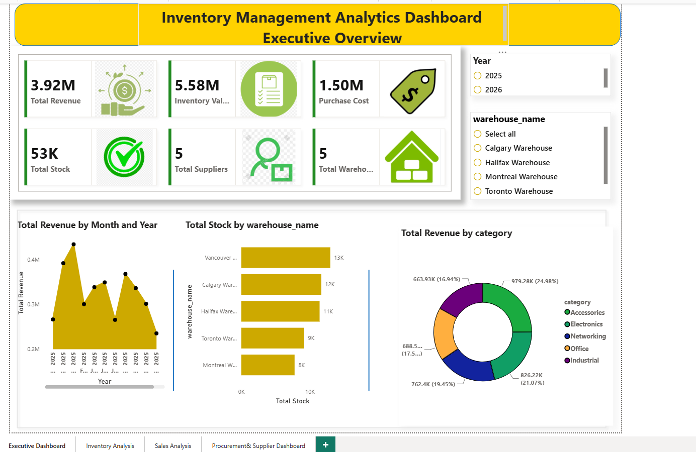
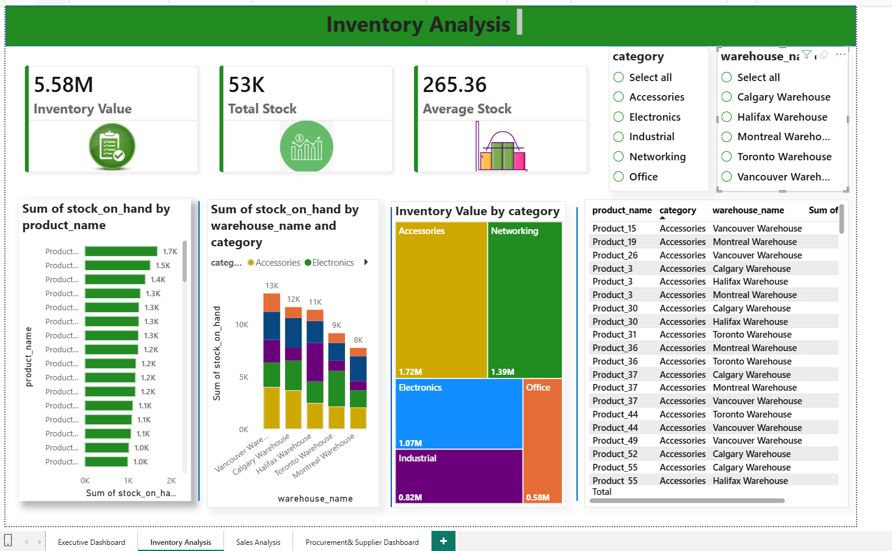
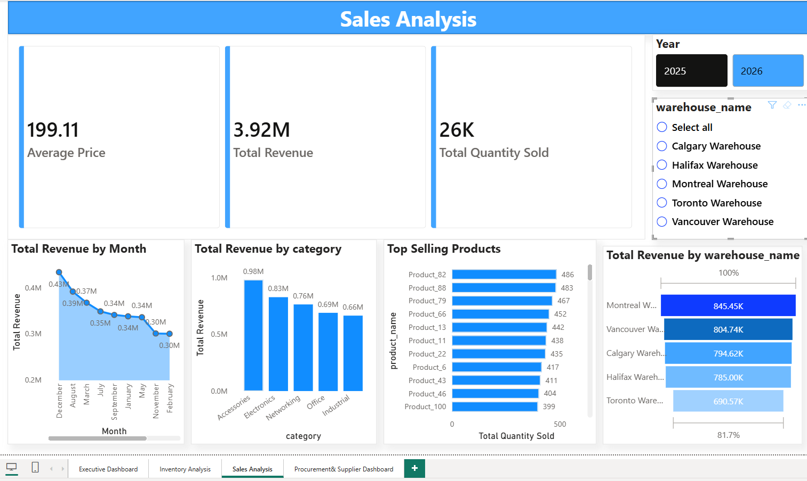
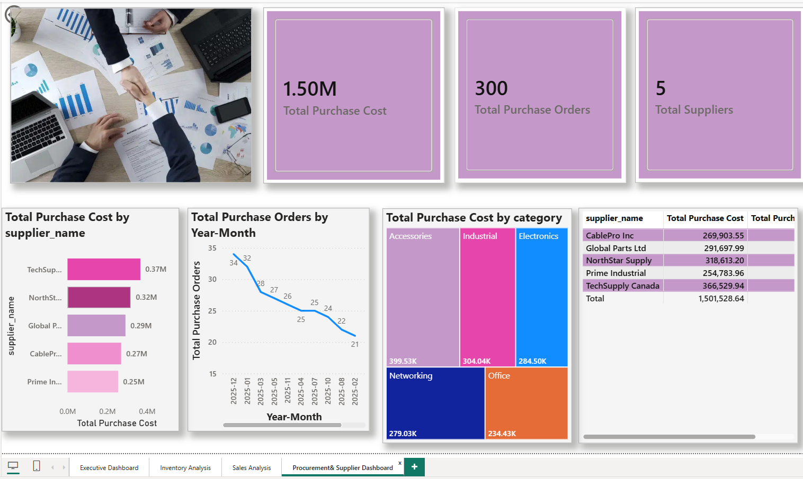
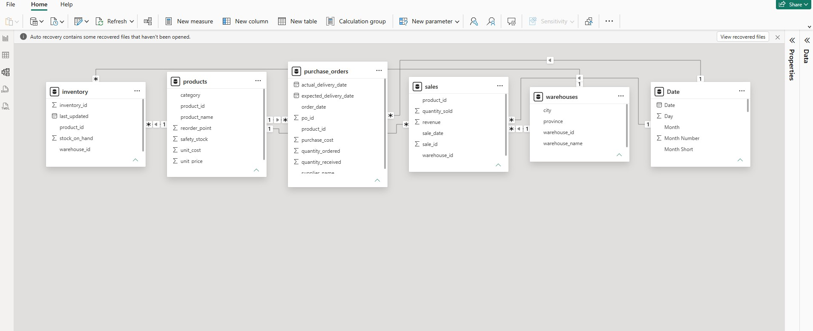

# Executive Supply Chain Dashboard | Power BI

An interactive Business Intelligence dashboard built with **Microsoft Power BI** to analyze sales performance, inventory health, warehouse operations, and procurement activities.

This project demonstrates how Power BI can transform raw operational data into meaningful insights that support data-driven business decisions.

---

## Project Overview

The dashboard was developed using a simulated retail inventory and supply chain dataset. It provides an executive-level view of business performance through interactive visualizations, KPI cards, slicers, and DAX measures.

The report is designed for business users such as Supply Chain Managers, Procurement Managers, Operations Managers, and Business Analysts.

---

## Project Highlights

- 📊 Built an interactive Power BI dashboard with four report pages.
- 📈 Analyzed 100,000 sales transactions and 20,000 purchase orders.
- 📦 Created a relational data model using multiple fact and dimension tables.
- 📐 Developed DAX measures for key business KPIs.
- 🎯 Designed executive dashboards for inventory, sales, and procurement analysis.
- 💼 Generated actionable business insights to support operational decision-making.

## Dashboard Pages

### 1. Executive Dashboard

Provides a high-level overview of business performance.

#### Key KPIs

- Total Revenue
- Total Quantity Sold
- Total Inventory Value
- Total Purchase Cost
- Average Fill Rate

#### Visualizations

- Revenue Trend
- Revenue by Category
- Revenue by Warehouse
- Inventory Status
- Interactive Filters



---

### 2. Inventory Dashboard

Monitors inventory performance and stock availability.

#### Visualizations

- Inventory by Category
- Inventory by Warehouse
- Products Below Reorder Point
- Inventory Value by Category
- Stock Distribution



---

### 3. Sales Dashboard

Analyzes sales performance across products and warehouses.

#### Visualizations

- Monthly Revenue Trend
- Top Products by Revenue
- Revenue by Category
- Revenue by Warehouse
- Quantity Sold Analysis



---

### 4. Procurement Dashboard

Evaluates purchasing performance and supplier activity.

#### Visualizations

- Purchase Cost Trend
- Supplier Spend
- Average Lead Time
- Delivery Performance
- Purchase Order Analysis



---

## Dataset

The dashboard uses a simulated retail inventory dataset.

| Dataset | Records |
|---------|---------:|
| Products | 500 |
| Warehouses | 10 |
| Inventory | 5,000 |
| Sales | 100,000 |
| Purchase Orders | 20,000 |

---

## Data Model

The dashboard uses a relational data model where Products and Warehouses serve as dimension tables connected to Inventory, Sales, and Purchase Orders.



---

## DAX Measures

The dashboard uses several DAX measures to calculate business KPIs.

| Measure | Description |
|---------|-------------|
| Total Revenue | Total sales revenue |
| Total Quantity Sold | Total units sold |
| Inventory Value | Current inventory value |
| Total Purchase Cost | Total procurement spending |
| Average Fill Rate | Inventory fulfillment efficiency |
| Revenue Growth % | Monthly sales growth |
| Average Lead Time | Supplier performance |
| Inventory Turnover | Inventory efficiency |

Detailed DAX calculations are available in:

```
docs/dax_measures.md
```

---

## Business Insights

The dashboard enables decision-makers to:

- Monitor overall business performance through executive KPIs.
- Identify products that require replenishment.
- Compare warehouse performance.
- Analyze monthly sales trends.
- Track procurement spending.
- Evaluate supplier delivery performance.
- Support inventory planning and purchasing decisions.

Additional recommendations can be found in:

```
docs/business_recommendations.md
```

---

## Technologies Used

- Microsoft Power BI Desktop
- Power Query
- DAX
- Data Modeling
- CSV
- Microsoft Excel

---

## Skills Demonstrated

- Business Intelligence
- Dashboard Design
- Data Visualization
- Data Modeling
- Power Query
- DAX
- KPI Reporting
- Supply Chain Analytics
- Inventory Management
- Procurement Analytics
- Business Analysis

---

## Project Structure

```
powerbi-supply-chain-dashboard/
│
├── README.md
│
├── data/
│   ├── products.csv
│   ├── warehouses.csv
│   ├── inventory.csv
│   ├── sales.csv
│   └── purchase_orders.csv
│
├── powerbi/
│   └── Retail_Inventory_Analysis.pbix
│
├── screenshots/
│   ├── executive_dashboard.png
│   ├── inventory_dashboard.png
│   ├── sales_dashboard.png
│   ├── procurement_dashboard.png
│   └── data_model.png
│
├── docs/
│   ├── dashboard_guide.md
│   ├── dax_measures.md
│   └── business_recommendations.md
│
└── LICENSE
```

---

## Related Projects

This dashboard is part of a complete analytics portfolio built using the same business dataset.

### SQL Inventory Analysis

A MySQL project focused on inventory, sales, and procurement analysis using SQL.

Repository:

```
https://github.com/nusrat-kashfia/sql-inventory-analysis
```

---

### Excel Inventory Analysis Dashboard

An interactive Excel dashboard built using Pivot Tables, Pivot Charts, XLOOKUP, and Slicers.

Repository:

```
https://github.com/nusrat-kashfia/excel-inventory-analysis-dashboard
```

---

## About

This project was developed as part of my Business Intelligence and Data Analytics portfolio to strengthen my skills in Power BI, DAX, and Supply Chain Analytics.

I welcome feedback and suggestions for improvement.
